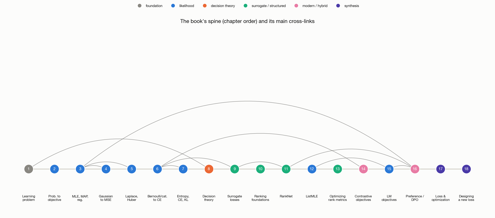

# loss-functions-lab



A small, focused Quarto book: where loss functions and ML objectives
actually come from, derived from first principles rather than presented as
a catalogue of formulas to memorize.

- Site: **[ioannisantoniadis.github.io/loss-functions-lab](https://ioannisantoniadis.github.io/loss-functions-lab/)**

## What this is

Most treatments of loss functions read like a glossary: "cross-entropy is
defined as...", followed by a formula and a few examples. This book insists
on a harder, more useful question for each one — *where does this formula
actually come from, and what does minimizing it mean?* Squared error comes
from assuming Gaussian noise; cross-entropy comes from a Bernoulli or
categorical likelihood and turns out to be exactly negative log-likelihood;
RankNet comes from a Bradley–Terry model over pairwise preferences; DPO
comes from turning a KL-regularized RL objective into a classification
problem over preference pairs. Every objective in this book is explicitly
labeled by where it came from — derived from likelihood, derived from
Bayesian/MAP reasoning, derived from decision theory, a surrogate/relaxation,
a heuristic design choice, or some hybrid of these — because that label is
what tells you what the objective actually promises you, and it's the same
question you need to ask when no existing loss fits your problem.

The book builds one continuous chain of reasoning, not eighteen independent
topics:

```
learning problem → risk / empirical risk → probabilistic model → likelihood
→ negative log-likelihood → MLE / MAP → classical losses (MSE, MAE, BCE,
cross-entropy) → decision theory / proper scoring rules → surrogate
objectives (hinge, logistic) → ranking objectives (RankNet, ListMLE) →
modern objectives (contrastive, LLM pretraining, DPO) → a reusable recipe
for designing the next one
```

It closes with a practical, reusable procedure for constructing a new
objective for a new problem — the actual goal of the book, and the reason
it isn't just a longer list of formulas.

## How this site is organized

Eighteen chapters plus [a map](https://ioannisantoniadis.github.io/loss-functions-lab/chapters/00-map.html)
of how they connect, in nine parts:

**I. The learning problem** — loss, risk, and empirical risk.
**II. Where objectives come from** — likelihood, negative log-likelihood,
MLE, MAP, and regularization.
**III. The classical losses, derived** — Gaussian noise → squared error;
Laplace noise, robustness, and Huber.
**IV. Classification and information theory** — Bernoulli/categorical
likelihoods → cross-entropy; entropy, cross-entropy, and KL divergence.
**V. Beyond likelihood** — decision theory and proper scoring rules.
**VI. Surrogates and margins** — from 0–1 loss to hinge and logistic loss.
**VII. Ranking objectives** — foundations, RankNet, ListMLE, and optimizing
ranking metrics directly.
**VIII. Modern and structured objectives** — contrastive learning,
language-model pretraining, and preference/DPO objectives.
**IX. Synthesis** — losses and the optimization landscape, and a recipe for
designing a new loss from first principles.

## Reading this site vs. reading the source

Every figure here was generated by a short, readable Python script in
[`scripts/figures/`](scripts/figures/) — a real computation (a maximum-
likelihood fit, a soft-thresholded MAP estimate, a RankNet gradient) on
toy or synthetic data, not a hand-drawn diagram. If a figure raises a
question the prose doesn't answer, the script that made it usually will.

## Repository layout

```
docs/                    Quarto book — the site source
  _quarto.yml              book config, chapter order, theme
  chapters/*.qmd            the 18 chapters + the map
  appendix-*.qmd             notation reference, further reading
  images/                     pre-generated static figures
  references.bib               real citations, used throughout
scripts/figures/          one small script per figure — real computed
                           output (numpy/scipy/matplotlib), not decoration
CONVENTIONS.md            the authoring template every chapter follows
```

## License

MIT — see [LICENSE](LICENSE).

---

Also see this author's [optimization-lab](https://github.com/ioannisantoniadis/optimization-lab)
(how losses are actually minimized) and
[modern-ai-systems-and-methods](https://github.com/ioannisantoniadis/modern-ai-systems-and-methods)
(where these objectives are used, in context, across ML systems).
