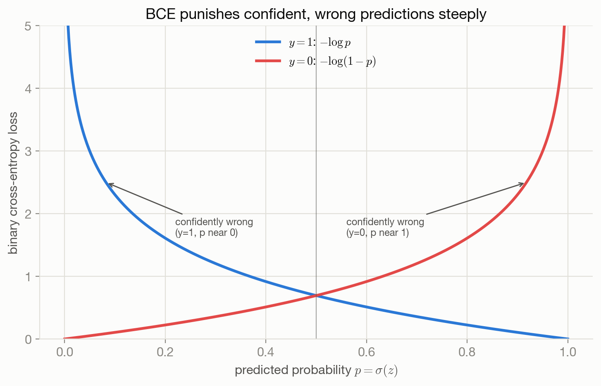

"Cross-entropy is defined as $-\sum_k y_k\log p_k$" is the sentence this
book set out to avoid writing without justification. Classification asks a
model to predict which of a small number of discrete outcomes occurred,
and by now the pattern from Chapters 4 and 5 should be predictable: pick
the probability distribution that matches the structure of $y$, take its
NLL, and see what falls out. For a two-outcome target, that distribution is
Bernoulli; for a $K$-outcome target, categorical. Both land on formulas
called "cross-entropy" — precisely because, as Chapter 7 makes exact, that
name isn't a coincidence.

## The problem

$y$ now lives in a discrete space: $y\in\{0,1\}$ for binary classification,
or $y\in\{1,\dots,K\}$ (or one-hot in $\mathbb{R}^K$) for $K$-way
classification. $f_\theta(x)$ can't sensibly be compared to $y$ by
subtraction the way a real-valued prediction can — what does "the
prediction was off by 0.3 classes" even mean? The probabilistic reframing
from Chapter 2 sidesteps the question entirely: instead of predicting a
class, predict a distribution *over* classes, and let NLL do the rest.

## Assumptions: binary case

$$
Y \sim \mathrm{Bernoulli}(p), \qquad p = \sigma(z), \quad z = f_\theta(x),
$$

where $\sigma(z) = 1/(1+e^{-z})$ is the logistic sigmoid. $\sigma$ is not
an arbitrary choice of squashing function: it is exactly the inverse of
the log-odds (logit) function $\mathrm{logit}(p) = \log\frac{p}{1-p} = z$,
so the model's raw output $z$ is being interpreted as a log-odds — a
natural, unconstrained real-valued encoding of "how much more likely class
1 is than class 0," which $\sigma$ then maps back into a valid probability
$(0,1)$. (The choice of *sigmoid specifically*, versus some other monotonic
map onto $(0,1)$, is closer to a design decision — motivated by exactly
this clean log-odds correspondence and its resulting logistic-regression
machinery — than a forced consequence of the Bernoulli assumption alone.)

## Derivation: Bernoulli → binary cross-entropy

The Bernoulli probability mass function can be written in one line that
covers both outcomes at once: $p(y\mid x;\theta) = p^y(1-p)^{1-y}$ (check:
at $y=1$ this is $p$; at $y=0$ it's $1-p$). Its negative log:

$$
-\log p(y\mid x;\theta) = -y\log p - (1-y)\log(1-p).
$$

Exactly one of the two terms is active for any given $y$: at $y=1$, the
$(1-y)$ factor zeroes out the second term and the loss is $-\log p$; at
$y=0$, it's $-\log(1-p)$. This is already the familiar BCE formula, and
nothing about the derivation involved a choice beyond "assume Bernoulli,
take the NLL" — the same two-step recipe as every chapter so far.

## Assumptions: categorical case

$$
Y \sim \mathrm{Categorical}(p_1,\dots,p_K), \qquad p_k = \mathrm{softmax}(z)_k = \frac{e^{z_k}}{\sum_{j=1}^K e^{z_j}},
$$

with $z=f_\theta(x)\in\mathbb{R}^K$ a vector of logits, one per class.
Softmax is motivated by wanting $\log p_k$ to be linear in $z_k$ (clean,
well-behaved gradients with respect to the logits) while guaranteeing every
$p_k>0$ and $\sum_k p_k=1$: setting $p_k \propto e^{z_k}$ achieves both —
exponentiating makes every value positive regardless of $z_k$'s sign, and
dividing by the sum normalizes.

## Derivation: categorical → cross-entropy

For a one-hot label with $y_c=1$ at the true class $c$ and $0$ elsewhere,
$p(y\mid x;\theta) = \prod_k p_k^{y_k} = p_c$ — the model's probability for
whichever class actually occurred. So

$$
-\log p(y\mid x;\theta) = -\log p_c = -z_c + \log\sum_{j=1}^K e^{z_j}.
$$

The middle expansion (substituting the softmax definition and using
$\log(a/b)=\log a - \log b$) is worth doing explicitly once: it shows
categorical cross-entropy reduces to "the true class's logit, minus the
log-sum-exp of every logit" — a single number computed directly from raw
logits, with no need to materialize the full probability vector first.

This matters beyond elegance. Computing $\sum_j e^{z_j}$ directly can
overflow for large logits; the standard fix (the **log-sum-exp trick**) is
to subtract $m=\max_j z_j$ before exponentiating,
$\log\sum_j e^{z_j} = m + \log\sum_j e^{z_j - m}$, which is mathematically
identical but numerically stable because every exponent is now $\le 0$.
This is exactly why deep learning frameworks fuse softmax and cross-entropy
into a single numerically stable operation rather than computing
$\mathrm{softmax}$ and then $\log$ as two separate steps — computing
softmax's normalized probabilities first and only then taking a log
reintroduces the overflow/underflow risk the fused form avoids.

## The resulting objectives

::: {.callout-note title="Definition — Binary cross-entropy (BCE)"}
$$
\ell_{\mathrm{BCE}}(\theta;x,y) = -y\log\sigma(z) - (1-y)\log(1-\sigma(z))
$$
:::

::: {.callout-tip title="Origin: derived from likelihood"}
The direct Bernoulli NLL — the same construction as MSE from Gaussian and
MAE from Laplace, now for a discrete target.
:::

::: {.callout-note title="Definition — Categorical cross-entropy"}
$$
\ell_{\mathrm{CE}}(\theta;x,y) = -z_c + \log\sum_{j=1}^K e^{z_j}, \qquad c = \text{the true class}
$$
:::

::: {.callout-tip title="Origin: derived from likelihood"}
Categorical NLL under a softmax link — again a direct consequence of the
distributional assumption, not a separately motivated formula that happens
to resemble it.
:::

## Interpretation

Minimizing BCE or categorical cross-entropy pushes $p_c \to 1$ for the
observed class $c$ — the model is being asked to assign as much probability
mass as possible to whatever actually happened. @fig-bce-curve shows the
shape of that push: the loss when $y=1$ falls smoothly toward 0 as $p\to1$
and rises steeply as $p\to0$, and symmetrically for $y=0$. This is exactly
Chapter 2's general NLL asymmetry (confident-wrong is punished far harder
than uncertain-wrong), specialized to two outcomes.

{#fig-bce-curve}

@fig-categorical-cross-entropy-surface extends this to three classes,
plotted directly over the probability simplex $(p_1,p_2)$ with
$p_3=1-p_1-p_2$: the loss (when the true class is class 1) is lowest at the
simplex's $p_1=1$ corner and rises toward the opposite edge, where
$p_1\to0$.

{#fig-categorical-cross-entropy-surface}

## Behavior and edge cases

Both losses are unbounded above: a model that assigns near-zero probability
to the true class pays an arbitrarily large penalty, which is what drives
gradient-based training away from confidently wrong predictions
aggressively. At the other extreme, a model that's correct but only mildly
confident ($p$ near 0.5–0.7) pays a small but nonzero cost — cross-entropy
keeps pushing toward full certainty even after the prediction is already
right, which is a real, sometimes underappreciated property (it's part of
why label smoothing exists, discussed in [Chapter 7](07-entropy-cross-entropy-kl.qmd)).

## Limitations

Both derivations assume the label itself is noise-free and the one-hot
encoding is the right target — an assumption that breaks down under label
noise (some observed labels are simply wrong) or genuine class ambiguity
(an example legitimately belongs partially to two classes). Neither failure
makes the loss stop working mechanically, but both undermine the
statistical guarantees the likelihood derivation was supposed to buy.

## Optimization implications

Sigmoid and softmax both **saturate**: for large $|z|$, $\sigma'(z)\to0$
and the softmax's gradient with respect to the dominant logit similarly
flattens, so a badly-wrong, extremely confident prediction can produce a
surprisingly small gradient even though the loss value itself is large —
a real optimization hazard explored further in
[Chapter 17](17-losses-and-optimization.qmd). This is a separate,
optimization-level concern from anything derived above about the loss's
statistical meaning.

## Connections

- [Chapter 2](02-probability-to-objective.qmd) is the general machine both
  losses here are specific instances of.
- [Chapter 7](07-entropy-cross-entropy-kl.qmd) formalizes exactly what
  "cross-entropy" means as an information-theoretic quantity and proves
  its precise relationship to KL divergence — read immediately after this
  one.
- [Chapter 9](09-surrogate-losses.qmd) derives a superficially similar
  logistic loss from a *margin/surrogate* angle rather than a Bernoulli
  likelihood — worth contrasting the two derivations of what can look like
  the same formula.
- [Chapter 15](15-language-model-objectives.qmd) reuses categorical
  cross-entropy token-by-token, unchanged in form, as the standard language
  model training objective.
